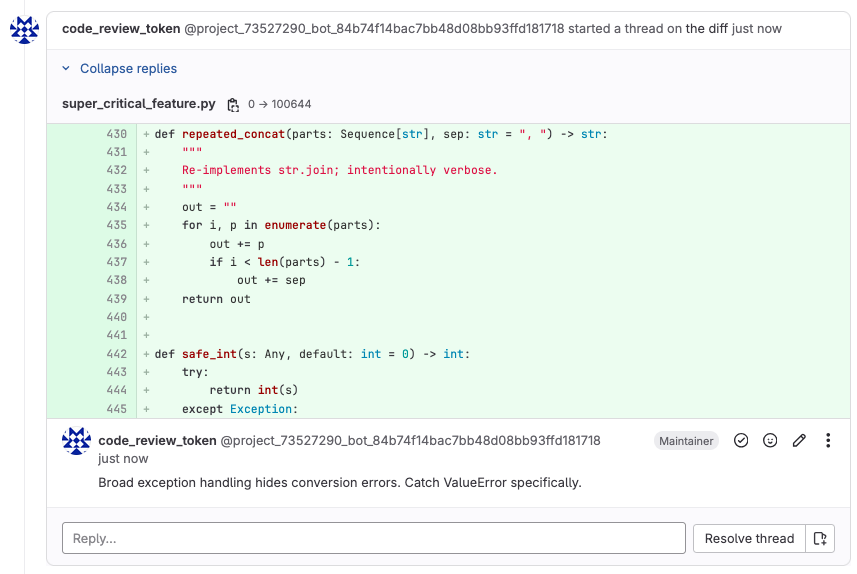

# AI-based Code Review

## Supported platforms

| Platform | Status |
| --- | --- |
| GitLab | ✅ Supported |
| GitHub | ⏳ Planned |

A minimal FastAPI implementation:
- Listen for GitLab merge request webhooks
- Fetch diffs and old file contents
- Build a prompt and ask model for a review
- Post the review as a Markdown note on the merge request

## Requirements

- Python 3.13

## Quickstart

These instructions will get the project running locally for development and testing purposes.

1. Copy environment example and edit secrets:

   ```bash
   cp .env.example .env
   # then edit .env and set OPENROUTER_API_KEY, AI_MODEL, GITLAB_TOKEN, and WEBHOOK_SECRET
   ```

2. Create and activate a virtual environment (recommended):

   ```bash
   python3 -m venv venv
   # macOS / Linux
   source venv/bin/activate
   # Windows (PowerShell)
   .\venv\Scripts\Activate.ps1
   ```

3. Install Python dependencies:

   ```bash
   pip install --upgrade pip
   pip install -r requirements.txt
   ```

4. Run the app locally with Uvicorn:

   ```bash
   uvicorn app.main:app --host 0.0.0.0 --port 8000 --reload
   ```

5. Expose your local server to GitLab for webhooks (optional, e.g. using ngrok):

   - Start ngrok: `ngrok http 8000`
   - Add a webhook in your GitLab project settings:
     - URL: `https://<your-ngrok>/webhook`
     - Secret token: value of `WEBHOOK_SECRET` in your `.env`
     - Trigger: Merge request events (updates)

6. (Optional) Run in Docker:

   ```bash
   # build
   docker build -t ai-gitlab-code-review .
   # run (pass environment variables via --env-file or -e)
   docker run --env-file .env -p 8000:8000 ai-gitlab-code-review
   ```

## Environment Variables

- `OPENROUTER_API_KEY` (required)
- `AI_MODEL` (required - Tested with **gpt-oss-20b** and **qwen3-coder**)
- `GITLAB_TOKEN` (required)
- `GITLAB_URL` (default: `https://gitlab.com/api/v4`)
- `WEBHOOK_SECRET` (required)
- `PORT` (default: `8000`)

Tips for local testing:

- **Use a throwaway GitLab project** for testing webhooks and comments so you don't spam production projects.
- If you need to simulate merge request payloads, save example webhook JSON and POST to `/webhook` with the `X-Gitlab-Token` header set to your `WEBHOOK_SECRET`.

## Notes & production tips

- This implementation returns 200 quickly and processes AI work in background tasks.
- The OpenAI call uses the 1.x client and runs in a worker thread.
- Keep tokens secret and serve via TLS.
- Consider deduplicating comments by detecting the HTML marker `<!-- ai-gitlab-code-review -->`.
- For large diffs, you must implement smarter chunking to fit token limits.

## Usage

- The service listens for GitLab merge request webhook updates on `/webhook` and responds with a 200 immediately while processing the review in the background.
- Reviews are posted as Markdown notes on the merge request.

Example review comment:


