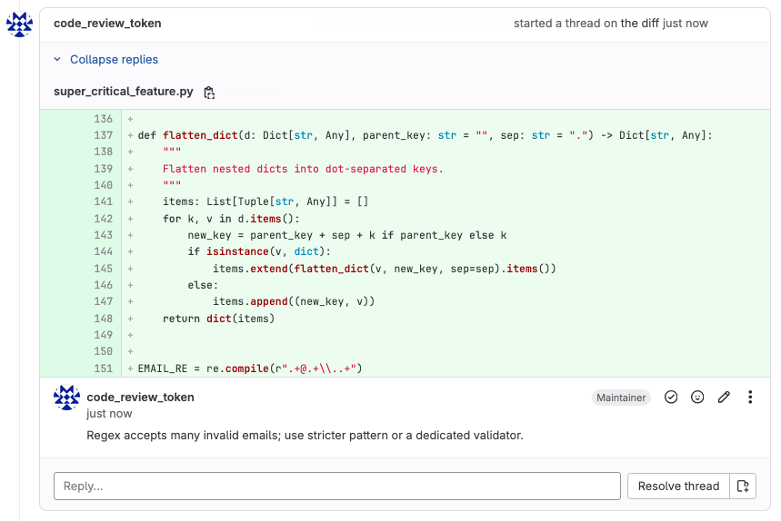

# AI-based Code Review

A minimal FastAPI implementation:
- Listen for merge request webhooks
- Fetch diffs and old file contents
- Build a prompt and ask model for a review
- Post the review as a Markdown note on the merge request

## Supported platforms

| Platform | Status |
| --- | --- |
| GitLab | ✅ Supported |
| GitHub | ✅ Supported |

## Requirements

- Python 3.13

## Quickstart

These instructions will get the project running locally for development and testing purposes.

1. Create a `.env` file and set your secrets:

   ```bash
   touch .env
   # Edit .env and set the required environment variables below
   ```

2. Create and activate a virtual environment (recommended):

   ```bash
   python3 -m venv venv
   # macOS / Linux
   source venv/bin/activate
   # Windows (PowerShell)
   .\venv\Scripts\Activate.ps1
   ```

3. Install Python dependencies:

   ```bash
   pip install --upgrade pip
   pip install -r requirements.txt
   ```

4. Run the app locally with Uvicorn:

   ```bash
   uvicorn app.main:app --host 0.0.0.0 --port 8000 --reload
   ```

5. (Optional) Expose your local server for webhooks (using ngrok):

   **For GitLab:**
   - Start ngrok: `ngrok http 8000`
   - Add a webhook in your GitLab project settings:
     - URL: `https://<your-ngrok>/gitlab/webhook`
     - Secret token: value of `GITLAB_WEBHOOK_SECRET` in your `.env`
     - Trigger: Pull requests (or merge requests) events

   **For GitHub:**
   - Start ngrok: `ngrok http 8000`
   - Add a webhook in your GitHub repository settings:
     - URL: `https://<your-ngrok>/github/webhook`
     - Content type: `application/json`
     - Secret: value of `GITHUB_WEBHOOK_SECRET` in your `.env`
     - Trigger: Pull requests (check "Pull requests" under "Let me select individual events")

6. (Optional) Run in Docker:

   ```bash
   # build
   docker build -t ai-gitlab-code-review .
   # run (pass environment variables via --env-file or -e)
   docker run --env-file .env -p 8000:8000 ai-gitlab-code-review
   ```

## Environment Variables

### AI Provider (choose one)
- `OPENAI_API_KEY` **OR** `OPENROUTER_API_KEY` (at least one required)
- `AI_MODEL` (required - Tested with **gpt-4o-mini**, **gpt-oss-20b**, and **qwen3-coder**)

### Platform Tokens (at least one platform required)
- `GITLAB_TOKEN` (for GitLab support)
- `GITLAB_API_URL` (default: `https://gitlab.com/api/v4`)
- `GITLAB_WEBHOOK_SECRET` (required for GitLab webhooks)
- `GITHUB_TOKEN` (for GitHub support)
- `GITHUB_API_URL` (default: `https://api.github.com`)
- `GITHUB_WEBHOOK_SECRET` (required for GitHub webhooks)

### Server Configuration
- `PORT` (default: `8000`)

Tips for local testing:

- **Use throwaway projects** for testing webhooks and comments so you don't spam production projects.
- For GitLab: POST merge request webhook JSON to `/gitlab/webhook` with `X-Gitlab-Token` header
- For GitHub: POST pull request webhook JSON to `/github/webhook` with `X-Hub-Signature-256` header
- If you need to simulate webhook payloads, save example webhook JSON and use curl or Postman

## Notes & production tips

- This implementation returns 200 quickly and processes AI work in background tasks.
- The OpenAI client uses the 1.x SDK with robust error handling and retry logic.
- Supports both OpenAI and OpenRouter APIs for maximum flexibility.
- Keep tokens secret and serve via TLS in production.
- Comment deduplication: Detect HTML markers `<!-- ai-gitlab-code-review -->` or `<!-- ai-github-code-review -->`.
- For large diffs, implement smarter chunking to fit token limits.
- The service is designed to be horizontally scalable with proper async/await patterns.

## Usage

### Webhook Endpoints
- **GitLab**: `/gitlab/webhook` - Listens for merge request events
- **GitHub**: `/github/webhook` - Listens for pull request events

### Workflow
1. Service receives webhook when PR/MR is created or updated
2. Returns 200 immediately, processes review in background
3. Fetches diff and file contents from the platform
4. Sends code to AI model for review
5. Posts review comments and summary back to the platform

### Features
- **Inline comments**: Specific line-by-line feedback
- **Summary reviews**: Overall assessment and recommendations
- **Markdown formatting**: Rich, readable review comments
- **Error resilience**: Robust handling of API failures
- **Async processing**: Non-blocking webhook responses

## Screenshots

### Example Review Comments

#### GitLab Merge Request Review

*Example of AI-generated code review comments on a GitLab merge request*

#### GitHub Pull Request Review

*Example of AI-generated code review comments on a GitHub pull request*
